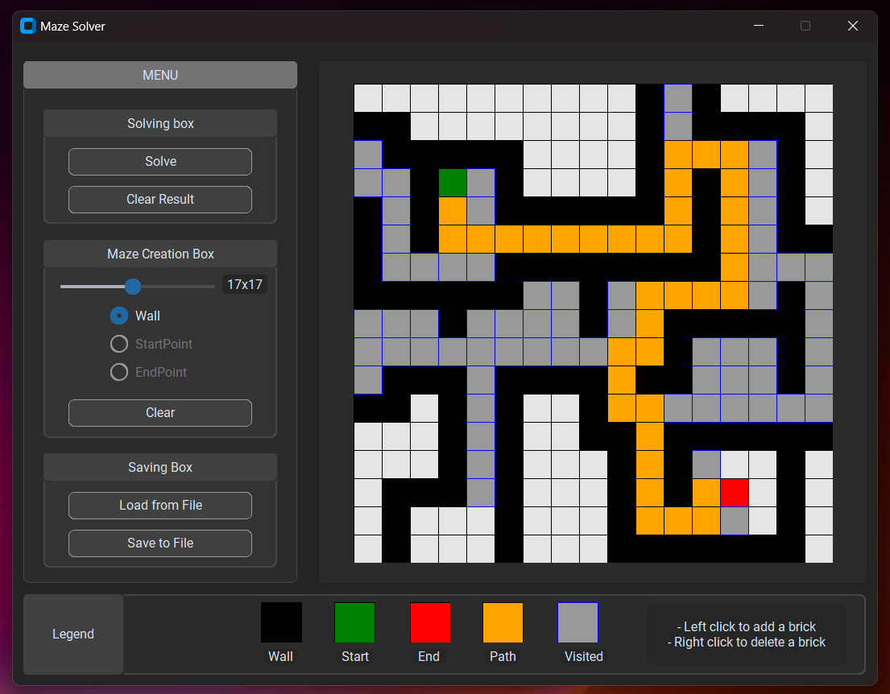

# Maze Creator and Solver

Welcome to my exciting project! In this Python and Tkinter-based maze solver, I've developed a powerful tool that can conquer any maze thrown my way. Leveraging the widely acclaimed Breadth-First Search (BFS) algorithm, my application expertly navigates through mazes of varying complexities, providing efficient and optimal solutions.

Through an intuitive and user-friendly Tkinter interface, you can interactively input your maze layout. My application then employs the BFS algorithm to systematically explore the maze, finding the shortest and most efficient path from the start to the destination.

The source code is available on GitHub under the MIT License.

## Badges

## Screenshots

<figure></figure>
